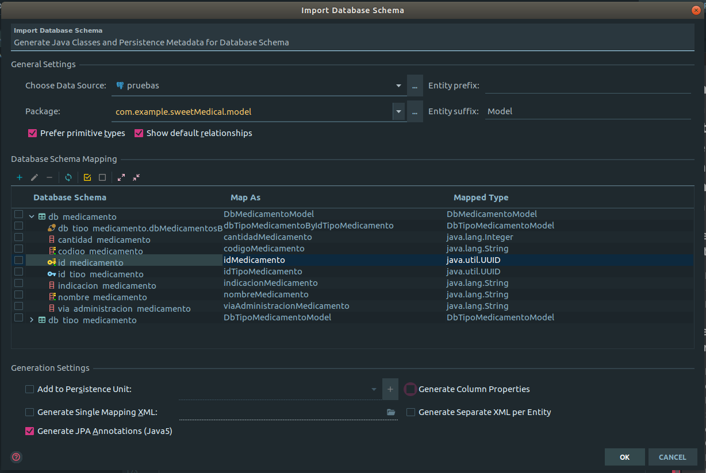

# Stored procedures en Spring Boot Jpa con Postgres: ejemplo con Medicamentos
Se hara un ejemplo usando las tablas Medicamento y TipoMedicamento.

### Tablas a usarse
```sql
CREATE TABLE db_tipo_medicamento
(
    id_tipo_medicamento          uuid PRIMARY KEY,
    nombretmedicamento           varchar(50) unique not null,
    descripcion_tipo_medicamento varchar(200)
);

CREATE TABLE db_medicamento
(
    id_medicamento                 uuid PRIMARY KEY,
    cantidad_medicamento           INTEGER,
    codigo_medicamento             varchar(20) unique not null,
    indicacion_medicamento         varchar(50),
    nombre_medicamento             varchar(50) unique not null,
    via_administracion_medicamento varchar(50),
    id_tipo_medicamento            uuid,
    constraint medicamento_tipo_medicamento_fk foreign key (id_tipo_medicamento)
        references db_tipo_medicamento (id_tipo_medicamento)

);
```

- Insertando unos registros de prueba:
```sql

insert into db_tipo_medicamento(id_tipo_medicamento, descripcion_tipo_medicamento, nombretmedicamento)
values ('0926dd9f-6a27-4e1c-aec8-ae060797d525', 'Para dolor', 'Analgesico');

insert into db_medicamento( id_medicamento, cantidad_medicamento, codigo_medicamento
                          , indicacion_medicamento, nombre_medicamento, via_administracion_medicamento
                          , id_tipo_medicamento)
values ('d7ba3ad5-b93b-4cfa-a22c-0f051b889ae5', 25, 'ABCD', 'cada 8 horas', 'acetaminofen', 'oral',
        '0926dd9f-6a27-4e1c-aec8-ae060797d525');
```

##### Aspectos a tomar en cuenta

- No puede existir un medicamento sin tener un tipo de medicamento asociado.
- El Nombre del medicamento debe ser unico.
- El codigo del medicamento debe ser unico.

## Ejemplo 1: Procedimiento que devuelve un STRING indicando la razón de si se puede insertar o no un medicamento en la base.

### Creando el procedimiento almacenado

El proposito de este procedimiento almacenado es devolver un mensaje de error o de aceptacion,
en caso se cumplan los requisitos para poder insertar un nuevo medicamento. 

1. Definimos el procedimiento, junto a sus parametros. Si no se especifica si es IN/OUT o IN/OUT,
tomara por defecto el valor de IN.
2. Debemos definir un parametro OUT que sera el valor que regresara la funcion, en este caso es de tipo varchar
ya que se creara una funcion que  **devuelva el mensaje de error**
3. No se especifica el ```Returns type``` ya que va implicito en el OUT
4. Ponemos en $$ $$ el cuerpo de la funcion
5. Bajo ```DECLARE``` Ponemos las variables que verificaran existencia.
6. Mediante ```If/Elsif/Else```, se decide el mensaje a devolver.

```postgresql
CREATE OR REPLACE FUNCTION check_availability(p_nombre_med varchar, p_codigo_med varchar, p_id_tipo_med uuid,

                                              out mensaje varchar)
as
$$
DECLARE
    check_id_tipo_med numeric;
    check_nombre_med  numeric;
    check_cod_med     numeric;

BEGIN
    select into check_id_tipo_med count(*)
    from db_tipo_medicamento
    where id_tipo_medicamento = p_id_tipo_med;

    select into check_nombre_med count(*)
    from db_medicamento
    where upper(nombre_medicamento) = upper(p_nombre_med);

    select into check_cod_med count(*)
    from db_medicamento
    where upper(codigo_medicamento) = upper(p_codigo_med);

    if check_id_tipo_med = 0 then
        mensaje := 'No existe el tipo de medicamento asociado.';

    elsif check_nombre_med > 0 then
        mensaje := 'Ya existe un medicamento con ese nombre.';

    elsif check_cod_med > 0 then
        mensaje := 'Ya existe un medicamento con ese codigo.';

    else
        mensaje := 'Se puede insertar registro';

    end if;

end;
$$
    language plpgsql;
```

#### Probando el SP

```sql
select check_availability('acetaminofen', 'abcd',
                          '0926dd9f-6a27-4e1c-aec8-ae060797d525');
```

## Llamando el SP desde Spring Boot

### En el repository

- Utilizando ```@Procedure``` llamamos el procedimiento creado previamente.
- Especificamos los parametros, teniendo cuidado de nombrarlos igual en el SP.
- Especificamos el tipo de valor de retorno que tendra

```java
@Procedure(procedureName = "check_availability")
    String checker(String p_nombre_med, String p_codigo_med, UUID p_id_tipo_med);
```

### En el Service

```java
public String checker(String p_nombre_med, String p_codigo_med, UUID p_id_tipo_med) {
        return repository.checker(p_nombre_med, p_codigo_med, p_id_tipo_med);

    }
```

#### En el controlador

```java
DateFormat fechaFormat = new SimpleDateFormat("HH:mm:ss dd/MM/yyyy");
    @CrossOrigin(origins = "http://localhost:3000")
    @PostMapping("/agregar")
    public ResponseEntity crearMedicamentoPrueba(@Valid @RequestBody MedicamentoModel medicamento) {
        medicamento.setIdMedicamento(UUID.randomUUID());
        Date date = new Date();
        DetalleResponseHttp detalle = new DetalleResponseHttp();
        detalle.setFecha(fechaFormat.format(date));
        detalle.setUrl("/medicamentos/agregar");

        String message = service.checker(medicamento.getNombreMedicamento(), medicamento.getCodigoMedicamento(), medicamento.getIdTipoMedicamento());
        System.out.println(message);

        detalle.setMensaje(message);
        if(!message.equals("Se puede insertar registro")){
            detalle.setHttpCodeName("No se pudo Agregar");
            detalle.setHttpCodeNumber(409);
            detalle.setHttpCodeType("ERROR");
            return new ResponseEntity(detalle, HttpStatus.CONFLICT);
        }
        else{
            detalle.setMensaje("se Agrego con exito");
            detalle.setHttpCodeName("Agregado con exito");
            detalle.setHttpCodeNumber(201);
            detalle.setHttpCodeType("SUCCESSFULL");
            Boolean resultado = service.guardar(medicamento);
            return new ResponseEntity(detalle, HttpStatus.CREATED);


        }
```
## Ejemplo 2: Creando un procedimiento que devuelva los medicamentos de acuerdo a un id de tipo de medicamento.

### Creando el Procedimiento almacenado
Basado en ejemplo en documentacion: [SQL Functions Returning Set](https://www.postgresql.org/docs/9.2/xfunc-sql.html).

- Se manda un argumento de tipo UUID que corresponde con el id de la llave a buscar.
- se devuelve un ```setof``` del tipo ```db_medicamento```, si se omite el setof solo se devolveria un registro.
- Especificamos que sera ```LANGUAGE sql;```


```postgresql
CREATE OR REPLACE FUNCTION test1(p_id_tipo uuid) RETURNS setof db_medicamento
AS
$$
SELECT *
FROM db_medicamento
where id_tipo_medicamento = p_id_tipo;
$$
    LANGUAGE sql;
```

### Llamando el SP desde la base

```sql
SELECT *
from test1('0926dd9f-6a27-4e1c-aec8-ae060797d525');
```

### En el repository
- El parametro de entrada que se manda dentro de ```@Query``` debera ir precedido por ```:```.

```java
@Query(value = "SELECT * from test1(:p_id_tipo);", nativeQuery = true)
    List<MedicamentoModel> test(@Param("p_id_tipo") UUID p_id_tipo);
```

### En el service

```java
public  List<MedicamentoModel> test( UUID p_id_tipo){
        return repository.test(p_id_tipo);
    }
```

### Funcion de prueba en el controller
```java
@CrossOrigin(origins = "http://localhost:3000")
    @GetMapping("/fk/{id}")
    public ResponseEntity fk_getter(@PathVariable UUID id) {
        DetalleResponseHttp detalle = new DetalleResponseHttp();
        List<MedicamentoModel> test = service.test(id);
        System.out.println(test);

        return new ResponseEntity(test, HttpStatus.NOT_FOUND);

    }
```


### Anexo: importando tablas desde la Base de Datos hacia Java

#### Crear nueva data source:
- Database-> + -> DataSource

#### Crear persistencia
- Ir a pestaña de Persistence -> click derecho -> Generate Persistence Mapping -> Database Schema
- Definir segun los campos deseados(Por ejemplo, cambiar object por UUID en los ids):

