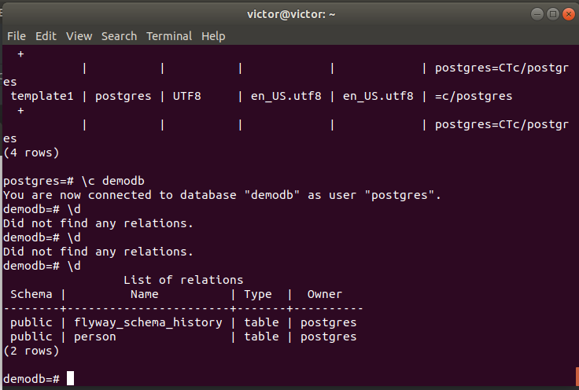
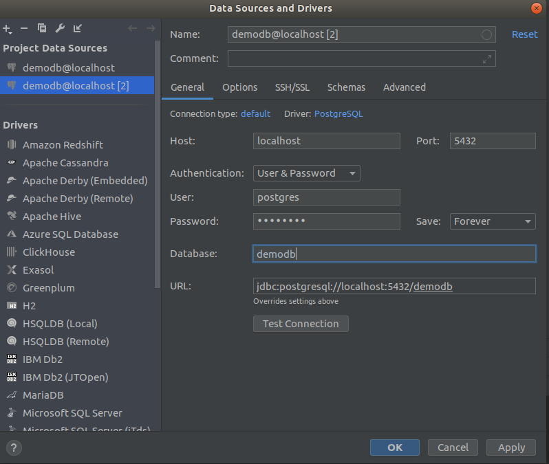

# Setting up docker db and access through DataGrip

## Prerequisites

- Docker
- Datagrip

### Download postgres image

- Create docker container

```shell script
sudo docker run --name postgres-spring -e POSTGRES_PASSWORD=password -d -p 5432:5432 postgres
```

- Start docker and exec

```shell script
      docker exec -it 643605b266d9  bin/bash
```

- Accessing to postgres CLI

```shell script
psql -U postgres
```

- **Basic commands**
    - ```\l``` List db's 
    - ```CREATE DATABASE demodb;```
    - ```\c demodb``` connect to demodb database
    - ```\dt``` look for tables in db
    - ```\d tablename``` to describe a table
- Run application.

You will see inside docker:


### Connecting through DataGrip:


