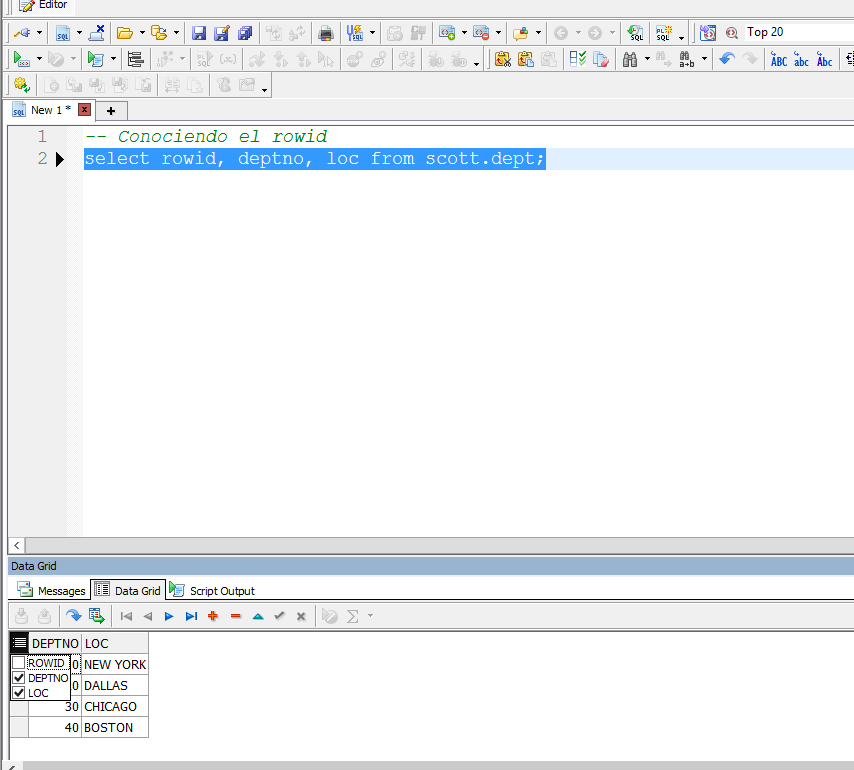
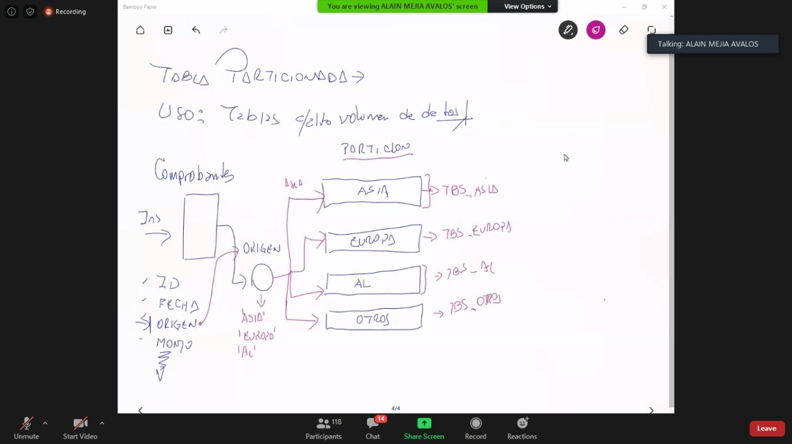
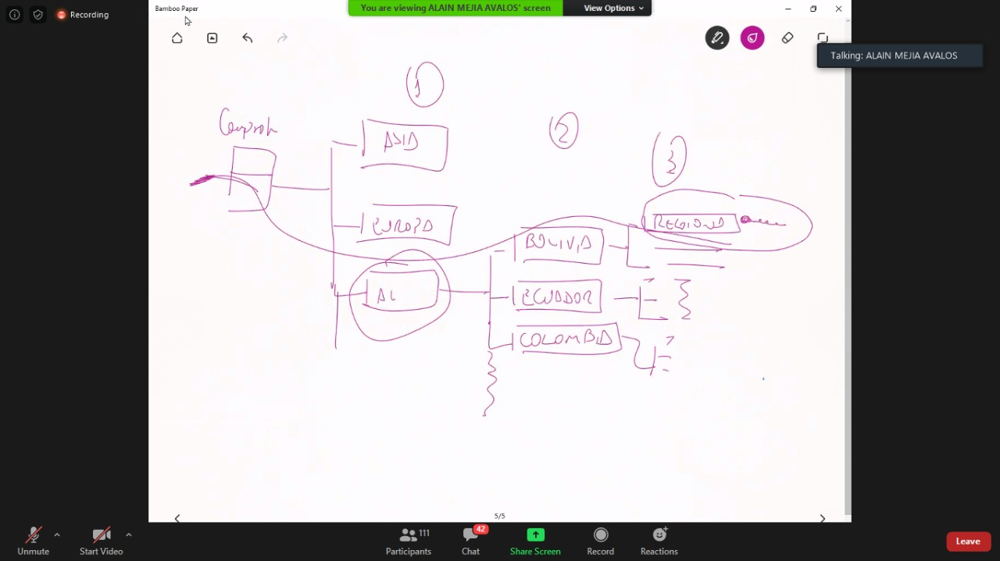
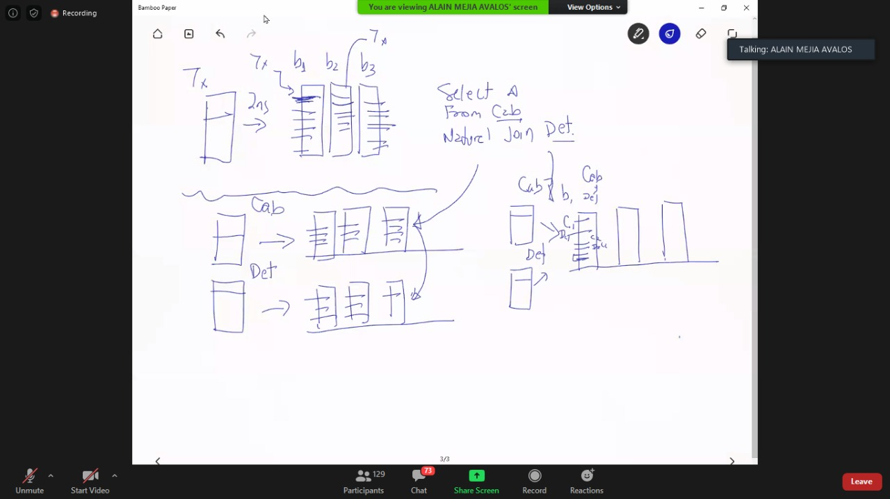

# Tipos de tablas en Oracle
[Drive](https://drive.google.com/drive/folders/1Gxxp6robmzc5NUwYtls_F48bE21dpkk9)


> Tablas e indices son lo que mas ocupan espacio en el datafile

Datafiles se divide en bloques de datos, que pueden ser 8kb, 12 kb, etc, esto tambien
puede ser configurable. Al momento de hacer consultas, consultamos N bloques de datos.
Cada bloque de datos tiene una cabecera y registros.

> Cada registro tiene un ROWID detallado en disco.

La consulta mas veloz es cunado filtramos por **RowID**.

- Por defecto no se ve.
- Para habilitarlo:



```sql
-- Conociendo el rowid
select rowid, deptno, loc from scott.dept;
```

- **Ejemplo 1**:

Ejemplos equivalentes:

- El Primero es mucho mas rapido

```sql
select rowid, deptno, loc from scott.dept
where rowid = 'AAAWbZAAGAAAAC3AAA';

select rowid, deptno, loc from scott.dept
where deptno = 10;
```

 > RowId: numero hexadecimal que identifica la posicion de un registro.

 Como encuentro el ROWID?

 Nos vamos a apoyar en los indices.
 > Indices son aceleradores de consultas, proveen el rowID.

 Indice hace el match entre el campo indexado y el rowId.

# Tabla regular

### Especificando el tablespace donde se crea una tabla

 ```sql
 CREATE TABLE COMPROBANTE
(ID NUMBER(10),
ORIGEN VARCHAR2(20),
FECHA DATE,
TIPO_PAGO CHAR(10),
ESTADO CHAR(1)) TABLESPACE TBS_REGULAR;
 ```
> Sino se especifica, se guarda en system.

### Ver donde se ha guardado una tabla

 ```sql
select * from DBA_TABLES;
 ```

### Creando un usuario y asignarle un tbs

 ```sql
CREATE USER  MARIA IDENTIFIED BY "MARIA"
DEFAULT TABLESPACE TBS_REGULAR;

 ```

### Relacion entre bloques y registros

 > Size de tabla

 ```sql
SELECT DBMS_ROWID.ROWID_BLOCK_NUMBER(ROWID) "NÚMERO DE BLOQUE", COUNT(*)
FROM COMPROBANTE
GROUP BY DBMS_ROWID.ROWID_BLOCK_NUMBER(ROWID)
ORDER BY DBMS_ROWID.ROWID_BLOCK_NUMBER(ROWID) ASC;
 ```

### Tamaño de la tabla

En megabytes
 ```sql
SELECT SEGMENT_NAME , SEGMENT_TYPE , BYTES/1024/1024 , BLOCKS
FROM user_segments  where segment_name = 'COMPROBANTE';
 ```

## Sequencias

- Sequencia:
    - Especificamos comienzo
    - El paso o incremento

### Crer secuencia

```sql
CREATE SEQUENCE SQ_PRUEBA START WITH 10;
```

### Siguiente valor

> Ocupamos metodo ```NEXTVAL```
```sql
SELECT SQ_PRUEBA.NEXTVAL FROM DUAL;
```

### Valor actual

```sql
-- Consultando el valor actual de la secuencia
SELECT SQ_PRUEBA.CURRVAL FROM DUAL; -- 12

```

### Sentencias propias de oracle 12c

#### Crear tabla con secuencia

```sql
CREATE SEQUENCE SQ_ARTICULO START WITH 1;
CREATE TABLE ARTICULO
( ID INTEGER DEFAULT SQ_ARTICULO.NEXTVAL,
  NOMBRE VARCHAR(100),
  ESTADO INTEGER ) TABLESPACE TBS_REGULAR;
```

- Insertando:

```sql
INSERT INTO ARTICULO ( NOMBRE , ESTADO ) 
VALUES ( 'PAPEL BOND 80GR', 1);  

INSERT INTO ARTICULO ( NOMBRE , ESTADO ) 
VALUES ( 'PLUMONES', 1); 
```

#### Relleno sea obligatoriamente usado

```sql
CREATE TABLE CLIENTE (
ID NUMBER GENERATED ALWAYS AS IDENTITY PRIMARY KEY,
RAZSOC VARCHAR2(30)) TABLESPACE TBS_REGULAR;
```

- No permite insertar ID:

```sql
INSERT INTO CLIENTE (RAZSOC ) VALUES ( 'DATA GENERAL');
INSERT INTO CLIENTE (RAZSOC ) VALUES ( 'DELL');
INSERT INTO CLIENTE (RAZSOC ) VALUES ( 'HP');
COMMIT;

-- No permite inserción de registro con declaración de ID
INSERT INTO CLIENTE ( ID , RAZSOC ) 
VALUES ( 100 ,'DATA GENERAL');
```

#### Creacion de tablas con columna identity de uso alternativo

Generado por DEFAULT con identity. Si no ingresas el dato, el rellenara el id,
pero **deja insertarlo**.

```sql
CREATE TABLE PROVEEDOR (
ID NUMBER GENERATED BY DEFAULT AS IDENTITY,
NOMBRE VARCHAR2(30)) TABLESPACE TBS_REGULAR;
```

- Insertando:

```sql

INSERT INTO PROVEEDOR (NOMBRE ) 
VALUES ( 'GLORIA');

INSERT INTO PROVEEDOR (NOMBRE ) 
VALUES ( 'DELL');

INSERT INTO PROVEEDOR (ID , NOMBRE ) 
VALUES ( 100, 'KIMBERLY CLARK');
```
> No permite valores nulos en esa columna.


#### Modificr columnas de tablas

```sql
ALTER TABLE PERSONA ADD DOCID VARCHAR(15);
ALTER TABLE PERSONA MODIFY CORREO VARCHAR(20);
ALTER TABLE PERSONA DROP COLUMN CELULAR;
```

### Columnas invisibles

```sql
CREATE TABLE PRODUCTO
( ID INTEGER GENERATED ALWAYS AS IDENTITY PRIMARY KEY,
  NOMBRE CHAR(100),
  PRECIO INTEGER,
  STOCK INTEGER  INVISIBLE  );
```

- Insertando y viendo

```sql
  -- Insertando datos
INSERT INTO PRODUCTO
(NOMBRE , PRECIO , STOCK )
VALUES ('MOTOR 1 HP' , 250 , 15);
COMMIT;

-- Al consultar no se muestran todas las columnas 
SELECT * FROM PRODUCTO;
```

- Viendo campo invisible: Hay que hacer mencion explicita.

```sql
SELECT  ID , NOMBRE , PRECIO , STOCK FROM PRODUCTO;
```

- Ver las columnas de tabla producto de la vista all_tab_columns

> las que tienen id son visibles, las que no, no
```sql
SELECT COLUMN_ID, OWNER, TABLE_NAME, COLUMN_NAME, DATA_TYPE, DATA_LENGTH 
FROM ALL_TAB_COLUMNS 
WHERE TABLE_NAME = 'PRODUCTO';
```


- Agregr columna invisible

```sql
ALTER TABLE PRODUCTO ADD ( ESTADO INTEGER INVISIBLE );
```

- Hacer visible un campo
```sql
ALTER TABLE PRODUCTO MODIFY STOCK VISIBLE;

```


### Crer tabla con misma estructura de la otra(Crer copia para pruebas por ejemplo)

```sql
CREATE TABLE FACTURA AS
SELECT * FROM COMPROBANTE;
```

### Proteger tabla solo como read-only/ write

- Read only

```sql
ALTER TABLE FACTURA READ ONLY;
```

- Read/write
```sql
ALTER TABLE FACTURA READ WRITE;
```


# Tabla particionada

> Uso: Para tablas que tendran gran voumen de informacion, millones de registros; por ejemplo la tabla comprobantes. Por lo general
entre todo nuestro modelo de base de datos solo son como 4 o 5 que se comportan asi.

> Como trabaja: 1 tabla logica, pero fisicamente son varias tablitas

- Particionando por campo origen, determinara en que area se guardara.
- Se crea una lista de valores aceptada para ese campo, por ejemplo: [asia,europa,AL]
- Si hay un texto que no es de ninguna, se pondra en otras.
- La data se comienza a segmenta




> ¿Cuándo está recomendado usar tablas particionadas? de forma genérica, podríamos decir que es recomendable a partir de 1 millón de registros.

### Paso 1 Crear TBS como particiones

> Calcular size de TBS: Cuanto pesara un registro y calcular para 2 o 3 years

Calculando peso para tabla ventas:

number: 1o bytes
origen: 20 bytes
fecha: 10 byes
Total: 50 bytes

Cuantos registros en dos years?

```sql
----------------------------------
-- 1. CREACION DE TBS
----------------------------------
CREATE TABLESPACE TBS_ASIA
DATAFILE 'C:\TEMP\DF_COMPROBANTES_ASIA.DBF'
SIZE 100M;

CREATE TABLESPACE TBS_EUROPA
DATAFILE 'C:\TEMP\DF_COMPROBANTES_EUROPA.DBF'
SIZE 100M;

CREATE TABLESPACE TBS_AL
DATAFILE 'C:\TEMP\DF_COMPROBANTES_AL.DBF'
SIZE 100M;

CREATE TABLESPACE TBS_OTROS
DATAFILE 'C:\TEMP\DF_COMPROBANTES_OTROS.DBF'
SIZE 100M;
```

### Paso 2 Crear tabla particionada


- Especificamos que es tabla particionada por ```list``` (Podria ser particionada por rango de valores, o oracle decida)
- Identificamos el campo de la tabla que define criterio de almacenamiento, cuyo contenido pueda separarse en particiones, aqui elegimos el origen.
- Declaro mis particiones

```sql
CREATE TABLE Ventas
(ID NUMBER(10),
 ORIGEN VARCHAR2(20),
 FECHA DATE default sysdate )

PARTITION BY LIST( ORIGEN)

(PARTITION ventas_ASIA  VALUES('ASIA')    tablespace TBS_ASIA,
 PARTITION ventas_EUROPA VALUES ('EUROPA') tablespace TBS_EUROPA,
 PARTITION ventas_AL     VALUES ('AL')   tablespace TBS_AL,
 PARTITION ventas_otros  VALUES(DEFAULT)   tablespace TBS_OTROS );

```

### insertando registros:

- al hacer insert, dependiendo del valor que lleven en origen, se guardara en el tbs correcto!

```sql
-------------------------------------------------
-- 3. INSERTANDO DATOS EN TABLAS PARTICIONADAS
-------------------------------------------------
INSERT INTO VENTAS
SELECT LEVEL, 'ASIA', SYSDATE
FROM DUAL CONNECT BY LEVEL < 100000;

INSERT INTO VENTAS
SELECT LEVEL, 'EUROPA', SYSDATE
FROM DUAL CONNECT BY LEVEL < 100000;
```

### Consultas registros

Si hago un * select sin partition no me ayuda en nada.
- Usar PARTITION

```sql
-------------------------------------------------
-- 4. QUERY DE TABLAS PARTICIONADAS
-------------------------------------------------
SELECT * FROM VENTAS;

SELECT * FROM VENTAS PARTITION ( ventas_ASIA );

SELECT * FROM VENTAS PARTITION (ventas_EUROPA);
```

> Mejorar aun mas? subparticionar en N niveles. Podemos segmentar hasta 15 niveles.
Podriamos paricionar por continente, pais y region, etc.




> Debemos agregar indices particionados tambien! 


## Tablas Externas

Deseamos incorporar informacion de un archivo txt al oracle


### Pasos:

- Crear directorio fisico y poner txt(este tiene campos separados por comas, y registros separados por lineas)
- Crear directorio oracle (Recordar que el comando no crea la carpeta)
- Crear pseudotabla
- Esa tabla esta vinculada al archivo .txt
- La tabla no almacena nada, pero al consultarla, llama data del archivo externo.

> Este tipo de tablas son de sólo lectura y no permite utilizar manipulación de datos (DML).
> Finalidad: Incoporar la data que esta afuera, dentro de la BD


- Crear directorio oracle
```sql
CREATE OR REPLACE DIRECTORY DIR_TXT AS 'C:\TXT';
```


- Ver directorios:
```sql
SELECT * FROM DBA_DIRECTORIES;
```


### Crear tabla

- Creamos campos que emulen lo que estan en el txt
- Organizacion externa:
    - Definimos directorio
    - Decimos qe registros estn delimitados por nuevas lineas
    - Campos separados por compas
    - Ubicacion del archivo, buscar Empleados.txt. Podrian ser n archivos, separados por comas.

```sql


```

> No se guarda info, solo es un vinculo a ese archivo, es una declarcion logica que vincula a esa pseudotabla en ese archivo.


### Ver tablas de externa

```sql
-- 3. LISTA DE TABLAS EXTERNAS
SELECT * FROM DBA_EXTERNAL_TABLES;
```

### operaciones select

```sql
SELECT * FROM EMPLEADOS_EXT
WHERE BASICO > 3000;
```

### Creando tabla nueva a partir de esa externa

```sql
CREATE TABLE TNUEVA AS SELECT * FROM EMPLEADOS_EXT;
SELECT * FROM TNUEVA;
```


## Clusterizada

Agrupa en un solo bloque registros de tablas. Por ejemplo cabecera y detalle.

