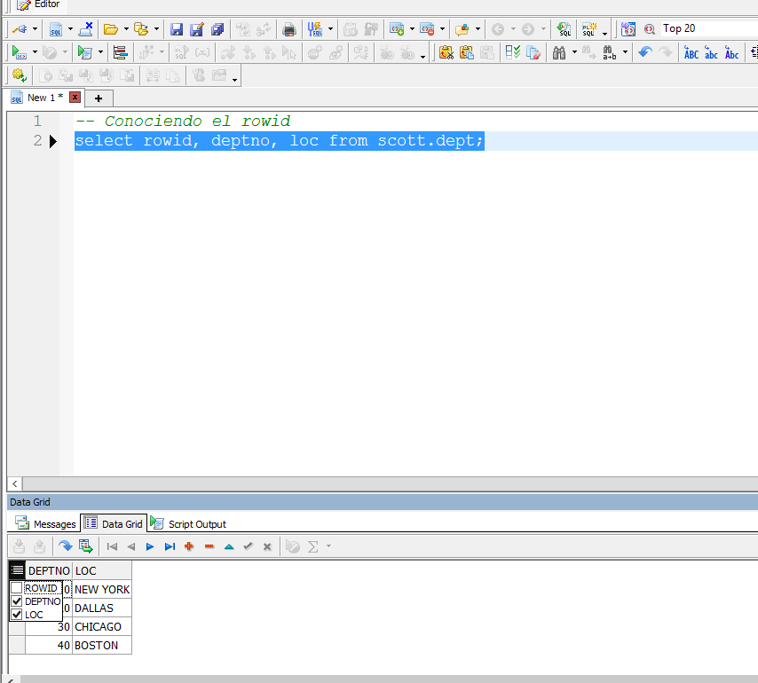

# Tipos de tablas en Oracle
[Drive](https://drive.google.com/drive/folders/1Gxxp6robmzc5NUwYtls_F48bE21dpkk9)


> Tablas e indices son lo que mas ocupan espacio en el datafile

Datafiles se divide en bloques de datos, que pueden ser 8kb, 12 kb, etc, esto tambien
puede ser configurable. Al momento de hacer consultas, consultamos N bloques de datos.
Cada bloque de datos tiene una cabecera y registros.

> Cada registro tiene un ROWID detallado en disco.

La consulta mas veloz es cunado filtramos por **RowID**.

- Por defecto no se ve.
- Para habilitarlo:



```sql
-- Conociendo el rowid
select rowid, deptno, loc from scott.dept;
```

- **Ejemplo 1**:

Ejemplos equivalentes:

- El Primero es mucho mas rapido

```sql
select rowid, deptno, loc from scott.dept
where rowid = 'AAAWbZAAGAAAAC3AAA';

select rowid, deptno, loc from scott.dept
where deptno = 10;
```

 > RowId: numero hexadecimal que identifica la posicion de un registro.

 Como encuentro el ROWID?

 Nos vamos a apoyar en los indices.
 > Indices son aceleradores de consultas, proveen el rowID.

 Indice hace el match entre el campo indexado y el rowId.

## Tabla regular

### Especificando el tablespace donde se crea una tabla

 ```sql
 CREATE TABLE COMPROBANTE
(ID NUMBER(10),
ORIGEN VARCHAR2(20),
FECHA DATE,
TIPO_PAGO CHAR(10),
ESTADO CHAR(1)) TABLESPACE TBS_REGULAR;
 ```
> Sino se especifica, se guarda en system.

### Ver donde se ha guardado una tabla

 ```sql
select * from DBA_TABLES;
 ```

### Creando un usuario y asignarle un tbs

 ```sql
CREATE USER  MARIA IDENTIFIED BY "MARIA"
DEFAULT TABLESPACE TBS_REGULAR;

 ```

### Relacion entre bloques y registros

 > Size de tabla

 ```sql
SELECT DBMS_ROWID.ROWID_BLOCK_NUMBER(ROWID) "NÚMERO DE BLOQUE", COUNT(*)
FROM COMPROBANTE
GROUP BY DBMS_ROWID.ROWID_BLOCK_NUMBER(ROWID)
ORDER BY DBMS_ROWID.ROWID_BLOCK_NUMBER(ROWID) ASC;
 ```

### Tamaño de la tabla

En megabytes
 ```sql
SELECT SEGMENT_NAME , SEGMENT_TYPE , BYTES/1024/1024 , BLOCKS
FROM user_segments  where segment_name = 'COMPROBANTE';
 ```

## Sequencias

- Sequencia:
    - Especificamos comienzo
    - El paso o incremento

### Crer secuencia

```sql
CREATE SEQUENCE SQ_PRUEBA START WITH 10;
```

### Siguiente valor

> Ocupamos metodo ```NEXTVAL```
```sql
SELECT SQ_PRUEBA.NEXTVAL FROM DUAL;
```

### Valor actual

```sql
-- Consultando el valor actual de la secuencia
SELECT SQ_PRUEBA.CURRVAL FROM DUAL; -- 12

```

### Sentencias propias de oracle 12c

#### Crear tabla con secuencia

```sql
CREATE SEQUENCE SQ_ARTICULO START WITH 1;
CREATE TABLE ARTICULO
( ID INTEGER DEFAULT SQ_ARTICULO.NEXTVAL,
  NOMBRE VARCHAR(100),
  ESTADO INTEGER ) TABLESPACE TBS_REGULAR;
```

- Insertando:

```sql
INSERT INTO ARTICULO ( NOMBRE , ESTADO ) 
VALUES ( 'PAPEL BOND 80GR', 1);  

INSERT INTO ARTICULO ( NOMBRE , ESTADO ) 
VALUES ( 'PLUMONES', 1); 
```

#### Relleno sea obligatoriamente usado

```sql
CREATE TABLE CLIENTE (
ID NUMBER GENERATED ALWAYS AS IDENTITY PRIMARY KEY,
RAZSOC VARCHAR2(30)) TABLESPACE TBS_REGULAR;
```

- No permite insertar ID:

```sql
INSERT INTO CLIENTE (RAZSOC ) VALUES ( 'DATA GENERAL');
INSERT INTO CLIENTE (RAZSOC ) VALUES ( 'DELL');
INSERT INTO CLIENTE (RAZSOC ) VALUES ( 'HP');
COMMIT;

-- No permite inserción de registro con declaración de ID
INSERT INTO CLIENTE ( ID , RAZSOC ) 
VALUES ( 100 ,'DATA GENERAL');
```