# Video1.  Introducción a Vistas del Diccionario de Datos, Curso Avanzado SQL

## Diccionario de datos
- El diccionario de datos es la metadata, es la definicion de los objetos que se tienen en una BD
- La metadata se encuentra en un directorio llamado "sys" que es el administrador de la BD, y el tienen toda una estructura para la gestion de la BD
- Las tablas de la BD obtienen informacion de los negocios (OBJETOS DEL NEGOCIO)
- El servidor oracle tambien contiene la vista de los diccionarios de datos (OBJETOS PARA GESTIONAR LA BD)


#### Estructura del diccionario de datos


#### Convencion de la nomenclatura

*Prefijos USER, ALL, DBA, V$*

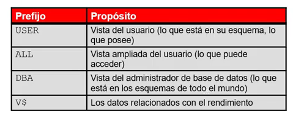

## Como usar el diccionario vistas
- Con DICTIONARY. Contiene los nombres y descripciones de las tablas de diccionario y puntos de vista
```sql
DESCRIBE DICTIONARY
```
```sql
SELECT * 
FROM    dictionary 
WHERE   table_name = 'USER_OBJECTS';
```

### Vistas USER_OBJECTS y ALL_OBJECTS
#### USER_OBJECTS:
- Para ver todos los objetos que se es dueño
- Se puede obtener un listado de todos los nombre de objetos y tipos en su esquema 
    - Fecha de creacion
    - Fecha de ultima modificacion
    - Estatus (valido o invalido)
```sql
SELECT  object_name, object_type, created, status
FROM    user_objects
ORDER BY   object_type;
```
#### ALL_OBJECTS:
- Para ver todos los objetos a los cuales tiene acceso 

#### Tabla de informacion
- Depende en el usuario que me encuentre asi me mostrara las tablas de ese esquema
```sql
DESCRIBE user_tables
```
```sql
SELECT table_name
FROM    user_tables;
```
#### Informacion de Columna
```sql
DESCRIBE user_tab_columns
```
```sql
SELECT column_name, data_type, data_length,
        data_precision, data_scale, nullable
FROM    user_tab_columns
WHERE   table_name = 'EMPLOYEES';
```
#### Informacion de Restricciones
- USER_CONSTRAINTS, describe las definiciones de restricciones sobre las tablas
- USER_CONS_COLUMNS, describe las columnas que son propiedad de usted y que se especifican en restricciones
```sql
DESCRIBE user_constraints
```
```sql
SELECT constraint_name, constraint_type,
        search_condition, r_constraint_name,
        delete_rule, status
FROM    user_constraints
WHERE   table_name = 'EMPLOYEES';
```
#### Consultando con USER_CONS_COLUMNS
- Devuelve las columnas que forman parte de un  constraint
```sql
DESCRIBE user_cons_columns
```
```sql
SELECT constraint_name, column_name
FROM    user_cons_columns
WHERE   table_name = 'EMPLOYEES';
```
#### Adicion de comentarios a una tabla
- Se puede agregar comentarios a una tabla o una columna usando COMMENTS
```sql
COMMENT ON TABLE employees
IS 'Employee Information';
```
```sql
COMMENT ON COLUMN employees.first_name
IS 'First name of the employee';
```
- Los diccionarios pueden ser vistos a traves de las vistas de diccionarios de datos
    - ALL_COL_COMMENTS
    - USER_COL_COMMENTS
    - ALL_TAB_COMMENTS
    - USER_TAB_COMMENTS

# Video 2. Creación de secuencias, sinónimos, e índices

## Hacer referencias a las Tablas de otro usuario
- Se debe de usar el nombre del propietario como prefijo para las tablas
```sql
SELECT * FROM userB.employees;
```
```sql
SELECT * FROM userA.employees;
```


## Secuencias
- Pueden generar de forma automatica numeros unicos
- Es objeto compartible
- Se puede utilizar para crear un valor de clave principal
- Reemplaza el codigo de aplicacion, por lo que esta en la capa de datos y tiene mejor rendimiendo
- Acelera el rendimiento de acceso a valores de secuencia cuando se almacena en cache en la memoria

#### Sentencia CREATE SECUENCE: Sintaxis
*Secuencia para generar numeros consecutivos de forma automatica* 
```sql
CREATE SECUENCE [ schema. ] sequence
[ { INCREMENT BYE | START WITH } integer
| { MAXVALIUE integer | NOMAXVALUE }
| { MINVALUE integer | NOMINVALUE } 
| { CYCLE | NOCYCLE }
| { CACHE integer | NOCACHE }
| { ORDER | NOORDER }  
]
```

#### Creando una secuencia
- Crear una secuencia llamada DEPT_DEPTID_SEQ que se utilizara para la clave principal de la tabla de DEPARTMENTS
- No usar la opcion CYCLE
```sql
CREATE SECUENCE dept_deptid_seq
                INCREMENT BY 10
                START WITH 280
                MAXVALUE 9999
                NOCACHE
                NOCYCLE;
```
## Pseudocolumnas NEXTVAL y CURRVAL
- NEXTVAL: Devuleve el siguiente valor de la secuencia disponible. Se devulve un valor unico cada vez que se hace referencia, incluso para los diferentes usuarios
- CURRVAL: Obtiene el valor de secuencia actual
- NEXTVAL debe ser emitido por esa secuencia antes que CURRVAL contenga ese valor

#### Usando una secuencia
*Inserte un nuevo departamento denominado "Suport" en la localidad 2500 con el id de departamento con el valor de secuencia* 
```sql
INSERT INTO     departments(
                department_id, department_name, location_id)
VALUES          (dept_deptid_seq.NEXTVAL,
                'Support', 2500);
```
*Ver el valor actual de la secuencia DEPT_DEPTID_SEQ*
```sql
CREATE      dept_deptid_seq.CURRVAL
FROM        dual;
```
#### Columna por defecto SQL usando una secuencia
- La expresion DEFAULT puede incluir la secuencia con seudocolumnas CURRVAL y NEXTVA, mientras exista la sentencia y usted tenga los privilegios encesarios para acceder a ella.
```sql
CREATE SEQUENCE s1 START WITH 1;
CREATE TABLE emp (a1 NUMBER DEFAULT s1 NEXTVAL NOT NULL, a2 VARCHAR2(10));
```

#### Los valores de secuencia Caching

- Alamacenamiento en cache de valores de secuencia en la memoria da un acceso mas rapido a esos valores

- Pueden ocurrir lagunas o vacios en valores de secuencia cuando
    - Una reversion se produce
    - Los fallos del sistema
    - Una secuencia se utiliza en otra tabla

### Modificando el valor de secuencia
*Cambie el valor de incremento, valor maximo, valor minimo, la opcion de ciclo o la opcion de cache*
```sql
ALTER SECUENCE dept_deptid_seq
                INCREMENT BY 20
                MAXVALUE 999999
                NOCACHE
                NOCYCLE;
```
#### Reglas para la modificacion de la secuencia
- Debe ser propietario o tener privilegio ALTER para la secuencia
- Solo los numeros de secuencia futuros se ven afectados
- En algunos se realiza la validacion
- Para eliminar una secuencia se usa DROP
```sql
DROP SECUENCE dept_deptid_seq;
```
#### Informacion de la secuencia
```sql
DESCRIBE user_sequences;
```

## Sinonimos
- Objetos de base de datos
- Puede ser creado para dar un nombre alternativo para una tabla o a otro objeto de base de datos
- No requiere almacenamiento que no sea su definicion en el diccionario de datos
- Es util para ocultar la identidad y la ubicacion de un objeto de esquema subyacente

*A travez del sinonimo se puede ocultar la identidad de la tabla, es buena practica para efectos de seguridad*

#### Creacion de un sinonimo de un objeto
- Crea una referencia mas facil a una tabla que es propiedad de otro usuario
- Acorta largos nombres de objeto 
```sql
CREATE [PUBLIC] SYNONYM synonym
FOR object;
```
*Crear un nombre abreviado para la vista DEPT_SUM_VU*
```sql
CREATE SYNONYM d_sum
FOR dept_sum_vu;
```
*Eliminar un sinonimo*
```sql
DROP SYNONYM d_sum;
```
#### Informacion de sinonimos
```sql
DESCRIBE user_synonym
```
```sql
SELECT * FROM user_synonym
```

## Indices
- Puede ser utilizado para acelerar la recuperacion de filas mediante el uso de un puntero
- Puede reducir la entrada/salida de disco mediante el uso de un metodo de acceso de ruta rapida para localizar datos de forma rapida
- Es dependiente los indices de las tablas
- Se usa y se mantiene de forma automatica por el servidor de Oracle

#### Como se crean los indices

- **Automaticamente:** Cuando se define una restriccion de CLAVE PRIMARIA o UNIQUE en una definicion de la tabla
- **Manualmente:** Se puede crear un indice unico o no unico en las columnas para acelerar el acceso a las filas

*Mejorar la velocidad de acceso de consulta de columna LAST_NAME en la tabla:*
```sql
CREATE INDEX emp_last_name_idx
ON employees(last_name);
```

*Crear indice con CREATE TABLE*
```sql
CREATE TABLE NEW_EMP
(employee_id NUMBER(6) PRIMARY KEY USING INDEX
                        (CREATE INDEX emp_id_idx ON
                        NEW_EMP(employee_id)),
first_name VARCHAR2(20),
last_name VARCHAR2(25);
)
```
```sql
SELECT INDEX_NAME, TABLE_NAME
FROM USER_INDEXES
WHERE TABLE = 'NEW_EMP';
```

#### Los indices de funcion-base
- Se basa en expresiones
- La expresion de indice se construye a partir de columnas de tabla, constantes, funciones de SQL y funciones definidas por el usuario
```sql
CREATE INDEX upper_dept_name_idx
ON dept2(UPPER(department_name));
```
```sql
SELECT *
FROM dept2
WHERE UPPER(department_name) = 'SALES';
```
#### Ejemplo de creacion de multiples indices en el mismo conjunto de columnas
```sql
CREATE INDEX emp_id_name_ix1
ON employees(employee_id, first_name);
```
```sql
ALTER INDEX emp_id_name_ix1 INVISIBLE;
```
```sql
CREATE BITMAP INDEX emp_id_name_ix2
ON employees(employee_id, first_name);
```
#### Directrices de la creacion del indice

#### Informacion de indices
```sql
DESCRIBE user_indexes
```
```sql
SELECT index_name, table_name, uniqueness
FROM user_indexes
WHERE table_name = 'EMPLOYEES';
```

#### Consultando USER_IN_COLUMNS
- Devuelve las columnas asociadas a un indice
```sql
DESCRIBE user_ind_columns
```
```sql
SELECT index_name, column_name, table_name
FROM user_ind_columns
WHERE index_name = 'LNAME_I DX';
```
#### Eliminacion de un indice
- Se realiza mediante DROP INDEX
- Para excluir a un indice, debe ser el propietario del indice o tener el privilegio DROP ANY INDEX
```sql
DROP INDEX emp_last_name_idx
```

# Video 3. Creacion de Vistas

- La vista es un subconjunto de informacion que ponemos tener en tablas base.**
- Las tablas base las construimos en los esquemas de las bases de datos**

## Ventajas de las vistas
- Restringir acceso a los datos
- Hace consultas complejas faciles
- Proporciona independencia de datos
- Presenta diferentes vistas de los mismos datos

## Vistas simples y complejas


#### Creacion de vista
*Crear la vista EMPVU80, que contiene detalle de los empleados del departamento 80*
```sql
CREATE VIEW empvu80
 AS SELECT employee_id, last_name, salary
 FROM   employees
 WHERE  department_id = 80;
```
*Describir la consulta de la vista*
```sql
DESCRIBE empvu80;
```
#### Modificacion de vista
- CREATE OR REPLACE VIEW son las clausulas para modificar una vista
```sql
CREATE OR REPLACE VIEW empvu80
 (id_number, name, sal, department_id)
AS SELECT employee_id, first_name || '' || last_name, salary, department_id
FROM   employees
WHERE  department_id = 80;
```

## Creacion de Vista Completa

*Crear una vista compleja que contiene las funciones de grupo para mostrar los valores de dos tablas*
```sql
CREATE OR REPLACE VIEW dep_sum_vu
 (name, minsal, maxsal, avgsal)
AS SELECT d.deparment_name, MIN(e.salary),
          MAX(e.salary), AVG(e.salary)
FROM      employees e JOIN departments d
ON        (e.department_id = d.department_id)
GROUP BY  d.department_name;
```
#### Informacion de las vistas
```sql
DESCRIBE user_views
```
```sql
SELECT view_name FROM user_views;
```
```sql
SELECT text FROM user_views
WHERE view_name = 'EMP_DETAILS_VIEW';
```

## Reglas para la realizacion de operaciones DML en una vista

- No se puede eliminar ni modificar una vista si la fila contiene
  - funciones de grupo
  - clausula GROUP BY
  - la palabra DISTINCT
  - la palabra reservada ROWNUM

- No se pueden agregar datos a una vista si la vista contiene:
  - funciones de grupo
  - clausula GROUP BY
  - la palabra DISTINCT
  - la palabra reservada ROWNUM
  - columnas definidas por las expresiones
  - columnas NOT NULL sin valor por defecto en las tablas de base que no estan seleccionados por la vista

## Uso de la clausula WITH CHECK OPTION
- Asegura que las operaciones DML se realizaron en la estancia de la vista en el dominio de la vista.


## Denegar operaciones DML
- Se puede asegurar que no hayan operaciones de DML mediante la opcion WITH READ ONLY


## Eliminar una vista
```sql
DROP VIEW empvu80
```

# Video 4. Gestionando Objetos de Esquemas

## Adicionando una restriccion


## Borrando un constraint
- utilizando DROP CONSTRAINT

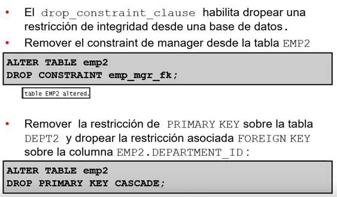

#### Dropiando un constraint ONLINE osea en vivo


## Clausula ON DELETE


#### Restricciones en cascada 


*Ejemplos de restricciones en cascada*


## Renombrando columnas de tablas y restricciones


#### Deshabilitando restricciones


#### Habilitando restricciones
- ENABLE CONSTRAINT

## Deferring constraints
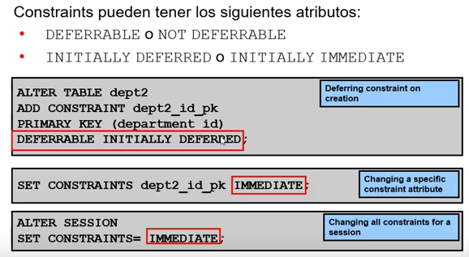

#### Diferencia entre INITIALY DEFERRED y INITIALY INMEDIATE


## DROP TABLE... PURGE
- Ademas de que dropea, libera el espacio disponible que tengamos de nuestros segmentos a nivel de nuestro table spaces que estemos trabajando
- Limpia la tabla
```sql
DROP TABLE emp_new_sal PURGE;
```

## Tablas temporales
- Existen en la BD durante la duracion de la transaccion o sesion que tengamos
- Son definidas de manera estatica a nivel de la metadata o el diccionario de la base de datos

*El carrito en una aplicacion en linea esta temporalmente en una cola*

*Cada articulo representa una fila que temporalmente esta en la tabla*

*Los datos que yo este eligiendo en el carrito estan de manera privada en mi sesion*

*Entonces las tablas temporables son tablas privadas a nivel de sesion*

*Al hacer el pago la aplicacion mueve esas filas que elegi en el carrito, y las coloca en una tabla permanente, y al finalizar la sesion esos datos en la tabla temporal son borrados*


#### Creando una tabla temporal con CREATE GLOBAL TEMPORARY TABLE


## Tablas Externas
#### Creando un directorio de tablas externas
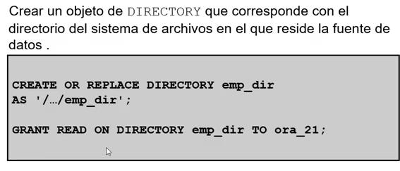

#### Creando una tabla externa
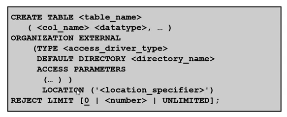

#### Creando una tabla externa utilizando ORACLE_LOADER 
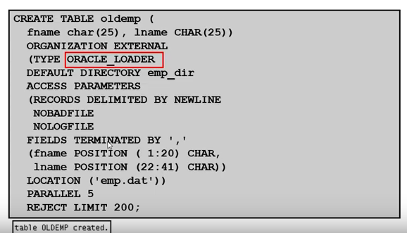

## Consultando tablas externas
- Sintacticamente la estructura esta en nuestra base 


## Creando Tabla externa usando ORACLE_DATAPUMP: 
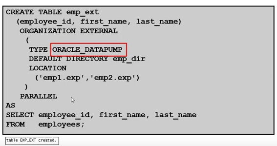

# Video 5. "Recuperacion de datos mediante subconsultas"

## Recuperacion de datos mediante una subconsulta como una fuente
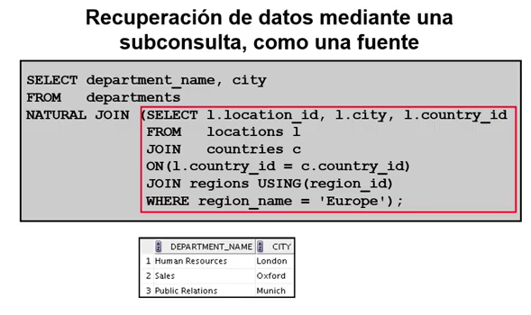

#### Ejemplo de recuperancion de datos usando Vista
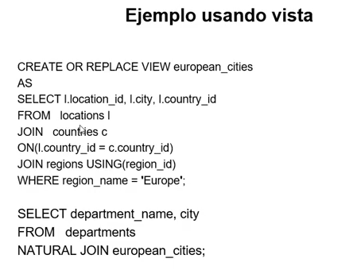

## Subconsultas con multiples columnas


## Comparacion de Subconsultas pares
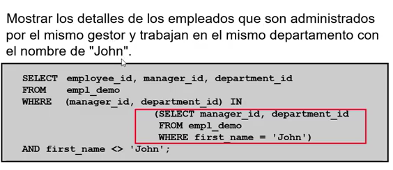

## Comparacion con Subconsulta No Par
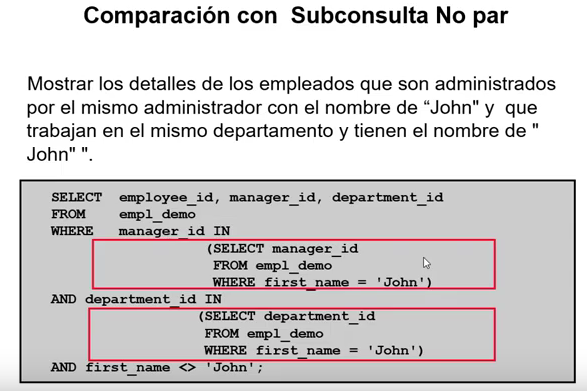

## Expresiones Subconsulta Escalar


#### Ejemplos de subconsulta escalar
 

## Subconsultas Correlacionadas
 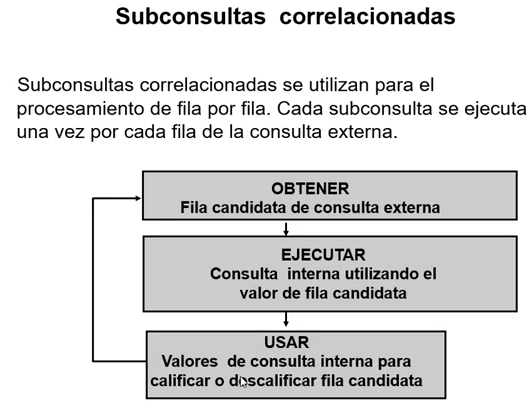

#### Sintaxis de la consulta correlacionada
 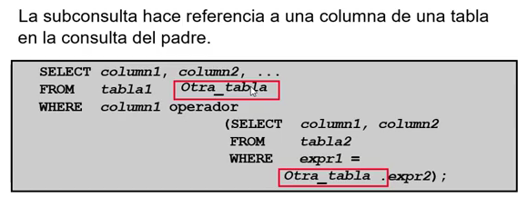

*Buscar todos los empleados que ganan mas que el salari medio en su departamento*

 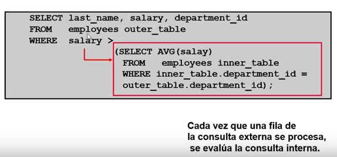

*Mostrar detalle de aquellos empleados que han cambiado puestos de trabajo por lo menos dos veces*

 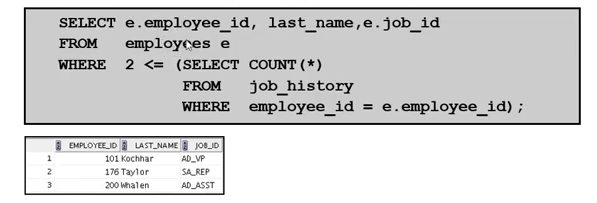

 ## Usando operados EXIST
 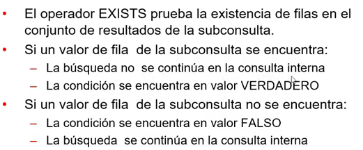

 #### Ejemplo de operador EXIST

 

#### Encontrar todos los departamentos que no tienen empleados
 

## Clausula WITH
 

*Mostrar los nombres del departamento y salarios totales para aquellos departamentos cuyo salario total es mayor que el salario promedio de todos los departamentos*

 

 ## Clausula WITH Recursiva
 

#### Ejemplo de WITH Recursiva
 
