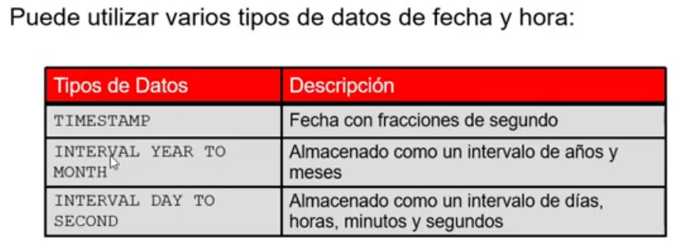

# Video 10 "Introducción al lenguaje de definición de datos(LDD)"

## Objetos de base de datos


## Tipos de Dato


## Tipos de Datos fecha y hora


## Opcion Default
- Los valores literales, expresiones o funciones de SQL son valores legales
- El nombre de otra columna o un pseudocolumna son valores ilegales
- El tipo de datos predeterminado debe coincidir con el tipo de datos de columna
```sql
CREATE TABLE hire_dates
            (id             NUMBER(8),
             hire_date      DATE DEFAULT SYSDATE);
```

## Sentencia CREATE TABLE

### Se especifica
- El nombre de la tabla
- El nombre de la columna, el tipo de datos de la columna y el tamaño de la columna

### Creando tablas
*Creando la Tabla*
```sql
CREATE TABLE dept
            (deptno         NUMBER(2),
             dname          VARCHAR2(14),
             loc            VARCHAR2(13),
             create_date    DATE DEFAULT SYSDATE);
```
*Confirmando creacion de tabla*
```sql
DESCRIBE dept
```

## Incluyendo restricciones
- Aseguran la coherencia y la integridad de la BD
- Los siguientes tipos de restricciones son validas
  - NOT NULL
  - UNIQUE
  - PRIMARY KEY
  - FOREIGN KEY
  - CHECK

#### Restriccion a nivel de la columna
```sql
CREATE TABLE employees(
    employee_id     NUMBER(6),
    CONSTRAINT emp_emp_id_pk PRIMARY KEY,
    first_name      VARCHAR2(20),
...);
```
#### Restriccion a nivel de tabla
```sql
CREATE TABLE employees(
    employee_id     NUMBER(6),
    first_name      VARCHAR2(20),
    ...
    job_id          VARCHAR2(10) NOT NULL,
    CONSTRAINT emp_emp_id_pk 
    PRIMARY KEY (EMPLOYEE_ID)
);
```
#### Restriccion NOT NULL
- La primary key, impone automaticamente la restriccion not null
#### Restriccion UNIQUE
- A los atributos que deban ser unicos dentro de las reglas del negocio se pone dicha restriccion
```sql
CREATE TABLE employees(
    employee_id     NUMBER(6),
    last_name       VARCHAR2(25) NOT NULL,
    email           VARCHAR2(25),
    salary          NUMBER(8,2),
    job_id          VARCHAR2(10) NOT NULL,
    hire_date       DATE NOT NULL,
    ...
    CONSTRAINT emp_email_uk     UNIQUE(email)
);
```
#### Restriccion PRIMARY KEY
- Si se quiere ingresar un nuevo registro en la tabla, la primary key obliga a que exista un codigo, por ejemplo un department_id
- Si el id ya existe entonces no se permite porque el valor de la primary key debe ser unica
```sql
CREATE TABLE employees(
    employee_id     NUMBER(6)    PRIMARY KEY,
    last_name       VARCHAR2(25) NOT NULL,
    email           VARCHAR2(25),
    salary          NUMBER(8,2),
    hire_date       DATE NOT NULL,
    ...
    CONSTRAINT emp_dept_fk      FOREIGN KEY (department_id)
     REFERENCES departments(department_id),
    CONSTRAINT emp_email_uk     UNIQUE(email)
);
```

#### Restriccion FOREIGN KEY
- Hace referencia a una primary key de otra tabla
- Ese valor debe existir a la tabla que hace referencia
```sql
CREATE TABLE employees(
    employee_id     NUMBER(6),
    last_name       VARCHAR2(25) NOT NULL,
    email           VARCHAR2(25),
    salary          NUMBER(8,2),
    hire_date       DATE NOT NULL,
    ...
    CONSTRAINT emp_dept_fk      FOREIGN KEY (department_id)
     REFERENCES departments(department_id),
    CONSTRAINT emp_email_uk     UNIQUE(email)
);
```

*FOREIGN KEY: Define la columna de la tabla secundaria en el nivel restricciones de tabla*

*REFERENCES: Identifica la tabla y la columna en la tabla padre*

*ON DELETE CASCADE: Elimina las filas dependientes en la tabla secundaria cuando se elimina una fila de la tabla padre*

*ON DELETE SET NULL: Convierte los valores de clave foranea dependientes a NULL*

#### Restricción CHECK
- En el se define una condicion que cada fila debe satisfacer
- Expresiones no permitidas:
    - Las referencias a la pseudocolumnas CURRVAL, NEXTVAL, LEVEL, ROWNUM
    - Las llamadas a las funciones SYSDATE, UID, USER, USERENV
    - Las consultas que hacen referencia a otros valores en otras filas
```sql
CREATE TABLE employees(
    ...,salary          NUMBER(8,2)
    CONSTRAINT emp_salary_min
            CHECK (salary > 0),...
);
```

*Al actualizar la tupla de salario, cada vez que se ingrese un valor mayor o igual a cero no va a permitir ese valor en la tupla*

## Violaciones de las restricciones
- Si agregamos un codigo padre que no existe a la foreing key, entonces da error
- No se puede eliminar una fila que contiene una primary key que se utiliza como ua foreign key de otra tabla

## Creacion de tabla utilizando una subconsulta
```sql
CREATE TABLE dept80
    AS
        SELECT  employee_id, last_name,
                salary*12 ANNSAL,
                hire_date
        FROM    employees
        WHERE   department_id=80;
```
```sql
DESCRIBE dept80
```

## Sentencia ALTER TABLE
*Se utiliza para:*

- Añadir una nueva columna
- Modificar una definicion de columna existente
- Definir un valor predeterminado para la nueva columna
- Dropear una columna
- Cambiar nombre de una columna
- Cambiar la tabla al estado de solo lectura

*Agregar una columna*
```sql
ALTER TABLE dept80
ADD         (job_id VARCHAR2(9));
```
*Modificar una columna*
```sql
ALTER TABLE dept80
MODIFY         (last_name VARCHAR2(30));
```
*Eliminar una columna*
```sql
ALTER TABLE dept80
DROP         (job_id);
```

## Opcion SET UNUSED
- Se usa para marcar una o mas columnas como no utilizadas
- DROP UNUSED COLUMNS para eliminar las consultas que fueron marcadas como no utilizadas
- Con ONLINE se indica que las operaciones DML en la tabla se permitira al marcar la columna o las columnas UNUSED

## Tablas de solo lectura
- Se realiza con ALTER TABLE
- Impide crear que sentendias DDL o DML cambien durante el mantenimiento de la tabla

*Solo lectura*
```sql
ALTER TABLE employees READ ONLY;
```
*Lectura y escritura*
```sql
ALTER TABLE employees READ WRITE;
```

## Eliminar una Tabla
- Mueve una tabla a la papelera de reciclaje
- Si se especifica PURGE entonces elimina la tabla y todos sus datos por completo
- Invalida los objetos dependientes y elimina los privilegios de los objetos en la tabla
```sql
DROP TABLE dept80;
```