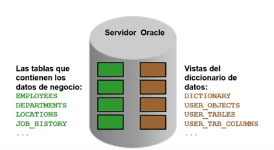

# Introducción a Vistas del Diccionario de Datos, Curso Avanzado SQL

## Diccionario de datos
- El diccionario de datos es la metadata, es la definicion de los objetos que se tienen en una BD
- La metadata se encuentra en un directorio llamado "sys" que es el administrador de la BD, y el tienen toda una estructura para la gestion de la BD
- Las tablas de la BD obtienen informacion de los negocios (OBJETOS DEL NEGOCIO)
- El servidor oracle tambien contiene la vista de los diccionarios de datos (OBJETOS PARA GESTIONAR LA BD)



#### Estructura del diccionario de datos


#### Convencion de la nomenclatura
*Prefijos USER, ALL, DBA, V$*


## Como usar el diccionario vistas
- Con DICTIONARY. Contiene los nombres y descripciones de las tablas de diccionario y puntos de vista
```sql
DESCRIBE DICTIONARY
```
```sql
SELECT * 
FROM    dictionary 
WHERE   table_name = 'USER_OBJECTS';
```

### Vistas USER_OBJECTS y ALL_OBJECTS
#### USER_OBJECTS:
- Para ver todos los objetos que se es dueño
- Se puede obtener un listado de todos los nombre de objetos y tipos en su esquema 
    - Fecha de creacion
    - Fecha de ultima modificacion
    - Estatus (valido o invalido)
```sql
SELECT  object_name, object_type, created, status
FROM    user_objects
ORDER BY   object_type;
```
#### ALL_OBJECTS:
- Para ver todos los objetos a los cuales tiene acceso 

#### Tabla de informacion
- Depende en el usuario que me encuentre asi me mostrara las tablas de ese esquema
```sql
DESCRIBE user_tables
```
```sql
SELECT table_name
FROM    user_tables;
```
#### Informacion de Columna
```sql
DESCRIBE user_tab_columns
```
```sql
SELECT column_name, data_type, data_length,
        data_precision, data_scale, nullable
FROM    user_tab_columns
WHERE   table_name = 'EMPLOYEES';
```
#### Informacion de Restricciones
- USER_CONSTRAINTS, describe las definiciones de restricciones sobre las tablas
- USER_CONS_COLUMNS, describe las columnas que son propiedad de usted y que se especifican en restricciones
```sql
DESCRIBE user_constraints
```
```sql
SELECT constraint_name, constraint_type,
        search_condition, r_constraint_name,
        delete_rule, status
FROM    user_constraints
WHERE   table_name = 'EMPLOYEES';
```
#### Consultando con USER_CONS_COLUMNS
- Devuelve las columnas que forman parte de un  constraint
```sql
DESCRIBE user_cons_columns
```
```sql
SELECT constraint_name, column_name
FROM    user_cons_columns
WHERE   table_name = 'EMPLOYEES';
```
#### Adicion de comentarios a una tabla
- Se puede agregar comentarios a una tabla o una columna usando COMMENTS
```sql
COMMENT ON TABLE employees
IS 'Employee Information';
```
```sql
COMMENT ON COLUMN employees.first_name
IS 'First name of the employee';
```
- Los diccionarios pueden ser vistos a traves de las vistas de diccionarios de datos
    - ALL_COL_COMMENTS
    - USER_COL_COMMENTS
    - ALL_TAB_COMMENTS
    - USER_TAB_COMMENTS
