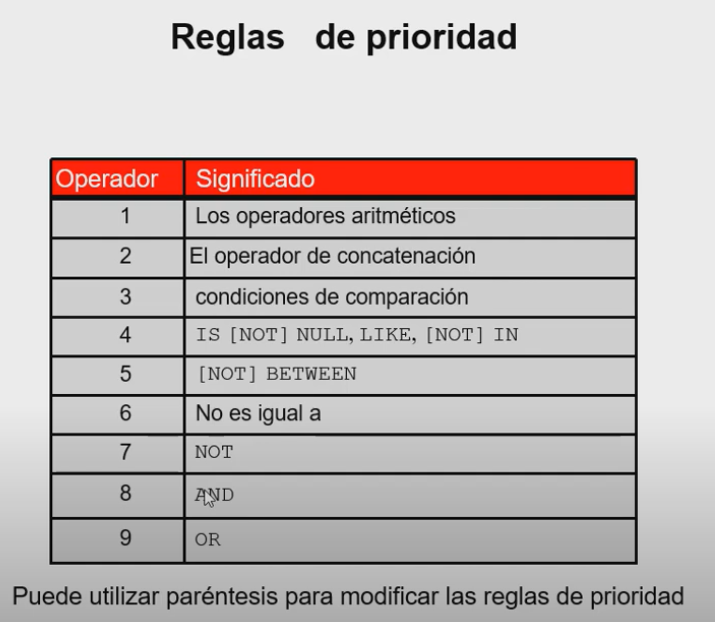
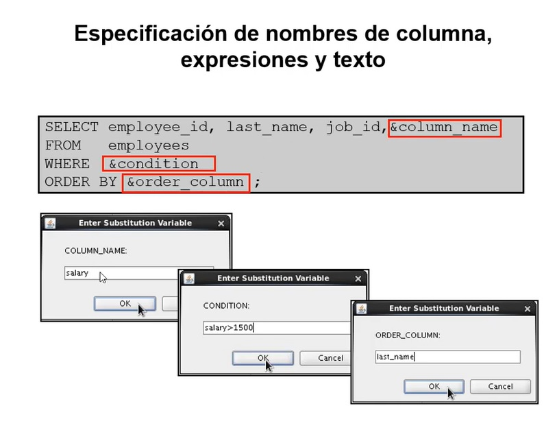

# Video 2

## Where
-  Comparacion con cadenas de caracteres y fechas van entre ```Comillas simples```.
-Fechas van en ```DD-MM-AA```

### BETWEEN
- Limite inferior y mayor, incluyendo ambos.
- ```AND``` en medio de ambos

```sql
select * from cuenta
where  saldo BETWEEN 200 AND 700;
```

### IN

Para comparar contra una lista de valores
```sql
select * from cuenta
WHERE  saldo IN (500,700,200);
```

### LIKE

- Comodines:
  - ```_```: Un caracter
  - ```%```: Multiples caracters

```sql
select * from cuenta
WHERE  NOMBRE_SUCURSAL LIKE '_e%';

select * from cuenta
WHERE  NOMBRE_SUCURSAL LIKE 'C%';
select * from cuenta
WHERE  NOMBRE_SUCURSAL LIKE '%n%';
```


### Prioridad



### ORDER BY
- Caracteristicas
  - ASC es predeterminado
  - Ultimo lugar

- Ejemplo 1: Usando Alias con ```ORDER BY```

```sql
SELECT NUMERO_PRESTAMO, IMPORTE*2000 as "Total" FROM prestamo 
ORDER BY importe DESC;
```

- Ejemplo 2: Misma columna pero por posicion de columna:

```sql
SELECT NUMERO_PRESTAMO, IMPORTE*2000 as "Total" FROM prestamo 
ORDER BY 2 DESC;
```

- Ejemplo 3: Ordenando dos columnas en base a alias con nombre compuesto

```sql
SELECT NUMERO_PRESTAMO as "Id de Prestamo", IMPORTE*2000 as "Total" FROM prestamo 
ORDER BY "Id de Prestamo" ASC,  2 DESC;
```

## Variables de Sustitucion

- &
- && Si vamos a seguir usando ese valor

Ej 1: Para numeros
```sql
select * from PRESTAMO
where importe = &numero ;
```

Ej 2: Para strings y fechas

```sql
select * from PRESTATARIO
where nombre_cliente = '&nombre';
```
Ej 3: Concatenando a variable leida:

```sql
SELECT * FROM CLIENTE WHERE CIUDADCLIENTE='&X.s';
```

Ej4: Usando en columnas y where



## Define and undefine

- Definir variable
- Liberar memoria

## VERIFY
Para ver en tiempo real los valores de la variable de sustitucion

```sql
SET VERIFY ON

```
