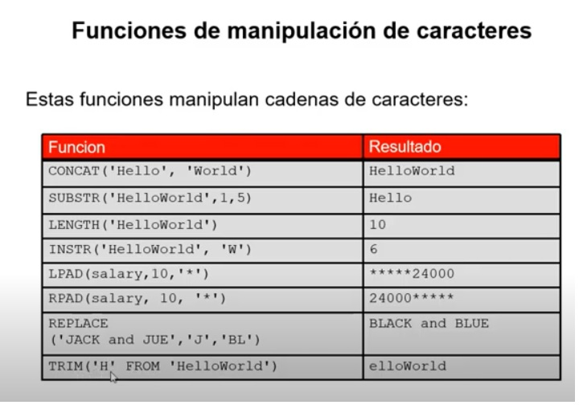

## Video 3

Funciones de conversion de una sola fila:



- REPLACE
- LPAD: Coloca caracteres a a izquierda
- RPAD: Al lado derecho
- LOWER

```sql
Select * from employees
where LOWER(last_name) = 'higgins';
```

## Numericas


### Fechas
- Formato por detecto
```sql
DD-MON-RR```

- Ver fecha actual
```sql
SELECT sysdate
FROM dual;
```
> Puede ser tambien CurrentDate.

#### Funciones de Fechas


